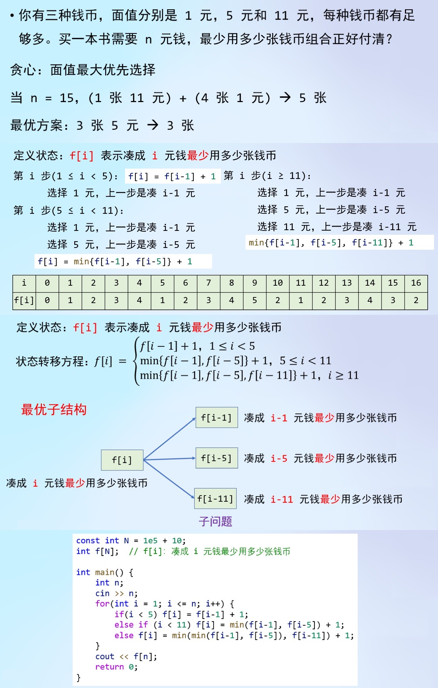

## 凑零钱 / 零钱兑换

小码王小韦老师讲义
https://www.yuque.com/xiaoweilaoshi/lge2bb/hfig31

### 备注
*** 注意min() 函数的用法，智能比较两个数的大小，不能处理三个及以上的参数 ***

### 后续练习：

T244965 【DP】凑零钱2
https://www.luogu.com.cn/problem/T244965

LCR 103. 零钱兑换
https://leetcode.cn/problems/gaM7Ch/description/

322. 零钱兑换
https://leetcode.cn/problems/coin-change/description/

